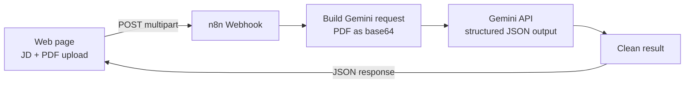

# Resume Fit Analyzer

A web tool that compares a resume against a job description and returns a fit score, a short summary, and a hiring recommendation. The frontend is a single HTML page; the analysis runs in an n8n workflow powered by Google Gemini.

**Live demo:** https://albertocj1.github.io/Resume-Fit-Analysis-App/

## What it does

Paste a job description, upload a resume as a PDF, and the tool returns:

- **Fit score (0–100)** with sub-scores for skills, experience, and education
- **Recommendation**: Strong Fit, Good Fit, Partial Fit, or Not a Fit, with a one-line reason
- **Summary** of how the candidate lines up with the role
- **Matched and missing skills** based only on what the resume shows
- **Suggestions** for strengthening the application

Gemini reads the PDF directly, so scanned and image-based resumes work as well as text-based ones.

## How it works



1. The page sends the job description and resume to an n8n webhook as `multipart/form-data`.
2. n8n encodes the PDF and sends it to Gemini along with the job description and a recruiter-style prompt.
3. Gemini responds in a fixed JSON schema, so every response has the same fields and the recommendation always uses one of the four labels.
4. n8n cleans the result and returns it to the page, which renders the score, scale, and skill lists.

### Scoring

| Component | Weight |
|---|---|
| Skills | 50% |
| Experience | 35% |
| Education | 15% |

| Score | Recommendation |
|---|---|
| 85–100 | Strong Fit |
| 70–84 | Good Fit |
| 50–69 | Partial Fit |
| Below 50 | Not a Fit |

## Tech stack

- **Frontend:** HTML, CSS, and vanilla JavaScript (no build step)
- **Workflow:** n8n (Webhook, Code, HTTP Request, Respond to Webhook nodes)
- **AI model:** Google Gemini (`gemini-2.5-flash`) via the Generative Language API
- **Hosting:** GitHub Pages

## Project structure

```
Resume-Fit-Analysis-App/
├── index.html                          # The web page
├── resume-fit-analyzer-gemini.json     # n8n workflow to import
└── README.md
```

## Setup

### 1. Set up the n8n workflow

1. In n8n, go to **Workflows → Import from File** and select `resume-fit-analyzer-gemini.json`.
2. Get a Gemini API key from [Google AI Studio](https://aistudio.google.com/).
3. Open the **Gemini Analyze Fit** node and create a **Header Auth** credential:
   - **Name:** `x-goog-api-key`
   - **Value:** your API key
4. Open the **Resume Webhook** node and set **Allowed Origins** to your site's address (for example `https://albertocj1.github.io`).
5. Activate the workflow and copy the webhook's **Production URL**.

### 2. Connect the page

Open `index.html` and paste the Production URL into the `ENDPOINT` constant near the top of the script:

```js
const ENDPOINT = "https://your-n8n-instance/webhook/resume-fit";
```

If `ENDPOINT` is left empty, the page shows a sample result so you can preview the design without a backend.

### 3. Deploy

1. Push the files to a public GitHub repository.
2. Go to **Settings → Pages**, set the source to **Deploy from a branch**, and choose `main` and `/ (root)`.
3. The site will be live at `https://albertocj1.github.io/Resume-Fit-Analysis-App/` within a few minutes.

## API reference

**Request:** `POST` to the webhook URL as `multipart/form-data`

| Field | Type | Description |
|---|---|---|
| `job_description` | text | Full job posting |
| `resume` | file | Resume in PDF format (up to 5 MB) |

**Response:** `application/json`

```json
{
  "fit_score": 78,
  "breakdown": { "skills": 82, "experience": 70, "education": 85 },
  "matched_skills": ["Python", "n8n", "FastAPI"],
  "missing_skills": ["Airflow", "dbt"],
  "summary": "The candidate shows strong hands-on automation work...",
  "recommendation": "Good Fit",
  "recommendation_reason": "Core automation skills match closely; the main gap is production experience.",
  "suggestions": ["Quantify workflow impact, such as hours saved."]
}
```

## Security notes

- The Gemini API key is stored as an n8n credential and never appears in the page or this repository.
- The webhook URL is visible in the page source. Restrict **Allowed Origins** to your domain and consider adding rate limiting or header authentication to prevent misuse of your API quota.
- Resumes are sent to Gemini for analysis and are not stored by this workflow.

## Limitations

- Only PDF resumes are accepted. Word files need to be exported to PDF first.
- Scores are AI-generated estimates meant to support, not replace, human review.

## Author

**Christian Joshua Alberto**
Portfolio: [cjalberto.vercel.app](https://cjalberto.vercel.app)

© 2026 Christian Joshua Alberto. All rights reserved.
